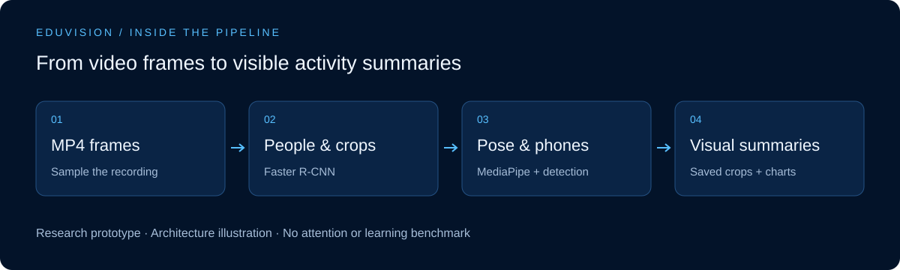
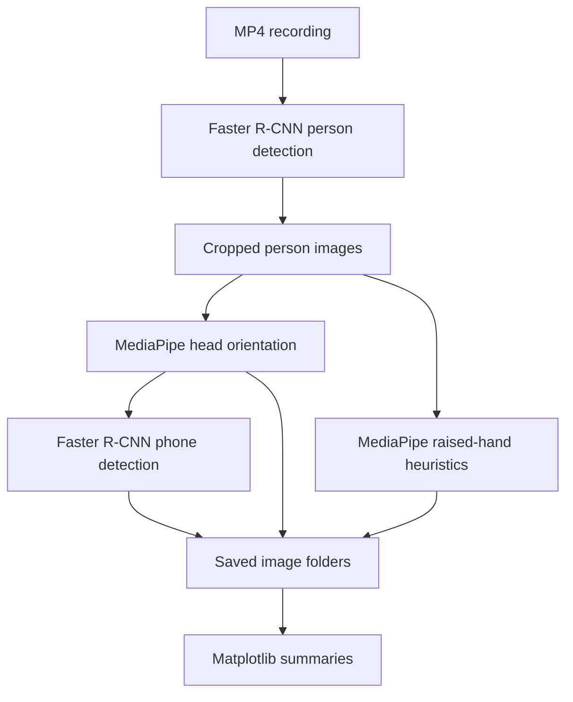

<picture>
  <source media="(prefers-color-scheme: dark)" srcset="docs/cover.svg">
  <source media="(prefers-color-scheme: light)" srcset="docs/cover-light.svg">
  
</picture>

# EduVision

**A computer vision prototype for exploring visible activity in classroom recordings.**

[Processing pipeline](#architecture) · [Run locally](#run-locally) · [Source](EduVision.py) · [Notebook](Body%20Pose%20Train%20and%20Data.ipynb)

## Project story

**Problem.** Reviewing a long classroom recording manually makes it difficult to summarize visible patterns across frames.

**Approach.** Detect people with Faster R-CNN, crop their images, estimate head orientation and raised-hand gestures with MediaPipe, then detect phones and summarize the image counts with Matplotlib.

**Current result.** The repository contains a Python pipeline, a Tkinter file picker, and a body-pose notebook. It is a research prototype, not a validated measure of attention, learning, or individual student performance. There is no bundled benchmark or sample classroom recording.

## Architecture





| Stage | Implementation |
| --- | --- |
| Person detection | Faster R-CNN with a ResNet50-FPN backbone; CUDA when available, otherwise CPU |
| Head orientation | MediaPipe FaceMesh landmarks and OpenCV pose estimation |
| Hand raising | MediaPipe Pose with wrist-position and arm-angle heuristics |
| Phone detection | Object detection on the classified crops |
| Visualization | Counts from the saved image folders, displayed with Matplotlib |

## Run locally

This is legacy research code without a dependency lockfile. Use an isolated Python environment and a MediaPipe version that still exposes `mp.solutions`; a fresh environment may require compatibility adjustments.

1. Clone the repository and create a virtual environment.
2. Install compatible versions of `torch`, `torchvision`, `opencv-python`, `mediapipe`, `numpy`, `matplotlib`, and `Pillow`. The desktop launcher also requires Tkinter.
3. Run the launcher from the repository root:

```sh
python EduVision_GUI.py
```

4. Choose an MP4 file. Model weights may download on first use. Use footage you are authorized to process.

The script writes `Output_Segmentation/`, `Classified_Images/`, and `Classified_Images_Detected/` beneath the working directory. Use a fresh working copy/output location for each recording: existing outputs are not cleared automatically.

For programmatic use:

```python
from EduVision import main_video_processing

main_video_processing("your_video.mp4")
```

## Known limitations

- The sampling calculation assumes a valid video rate of at least 5 FPS.
- Plotting expects every orientation output folder to exist; a missing category can raise an error.
- Counts describe detected crops, not unique people or validated engagement. Head pose is only a visual proxy.
- Processing runs synchronously in the desktop UI. Large recordings may make the window unresponsive.
- Saved crops can contain identifiable people. Keep input and output recordings private unless you have appropriate permission to share them.

## Repository guide

| File | Purpose |
| --- | --- |
| `EduVision.py` | Detection, classification, saved outputs, and charts |
| `EduVision_GUI.py` | Desktop MP4 picker and processing launcher |
| `Body Pose Train and Data.ipynb` | Body-pose exploration notebook |
